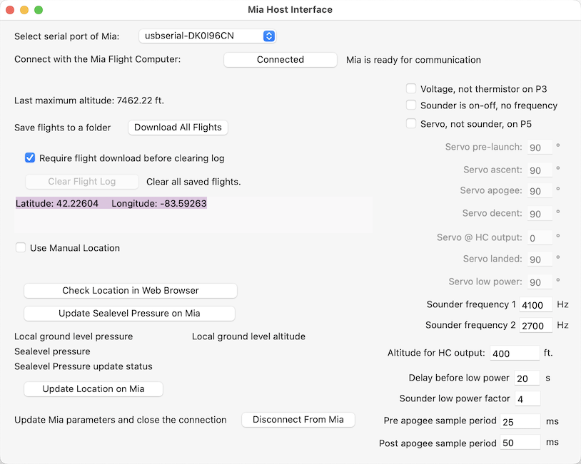
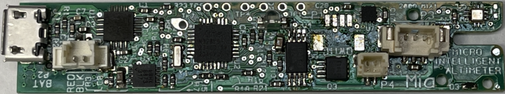

# MicroIntelligentAltimeter

The Micro Intelligent Altimeter (Mia) flight computer is not designed as a competition altimeter, but as a model rocket altimeter for young people curious to learn more.
That being said, kids can ask the hardest questions, like, how high did my rocket go, or how fast? So, Mia uses an accurate pressure sensor with a comprehensive software package wrapped around it to provide an accurate altitude.

User Interface on a Mac

  
The board is narrow enough to fit in a BT-5 body tube.

Back of Mia

